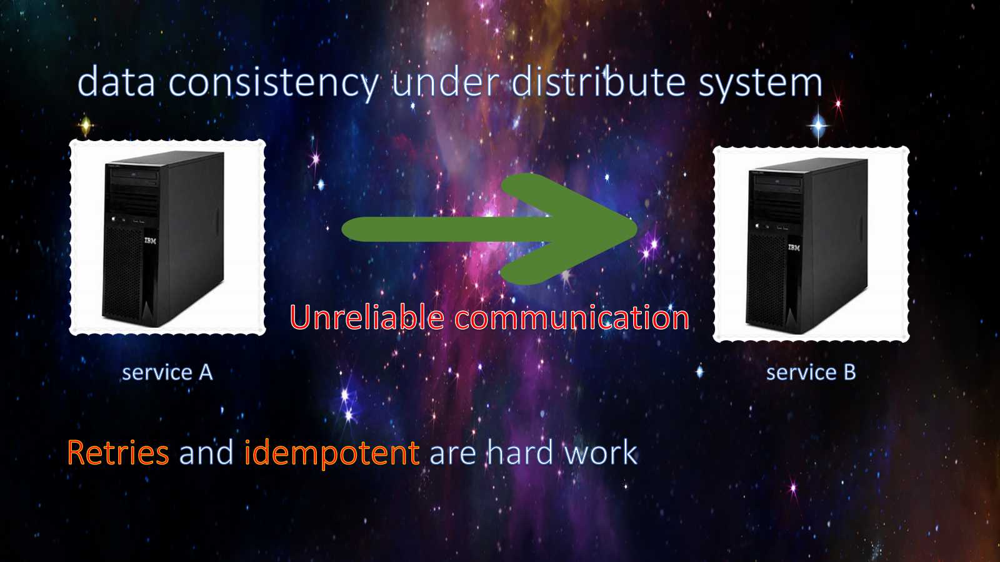
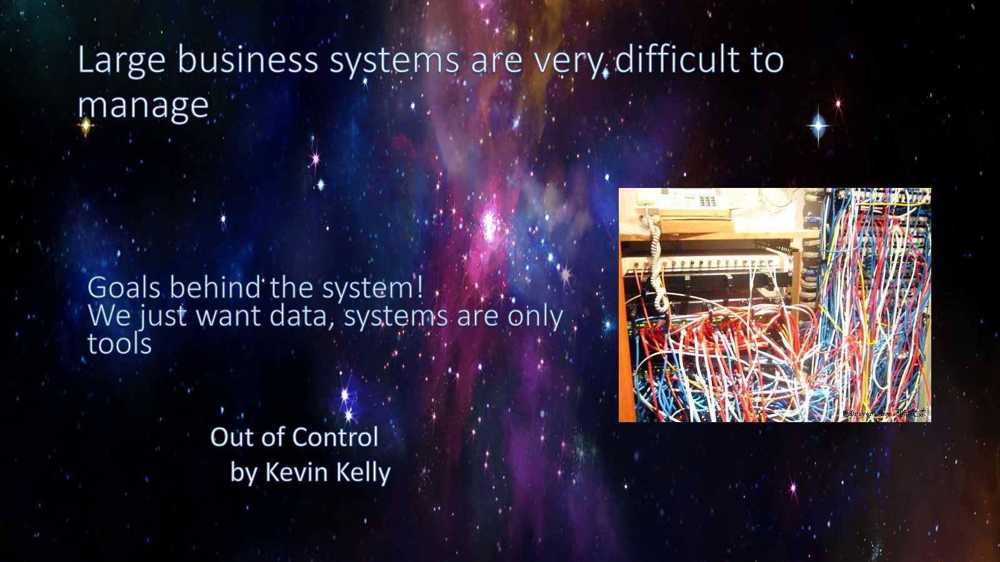
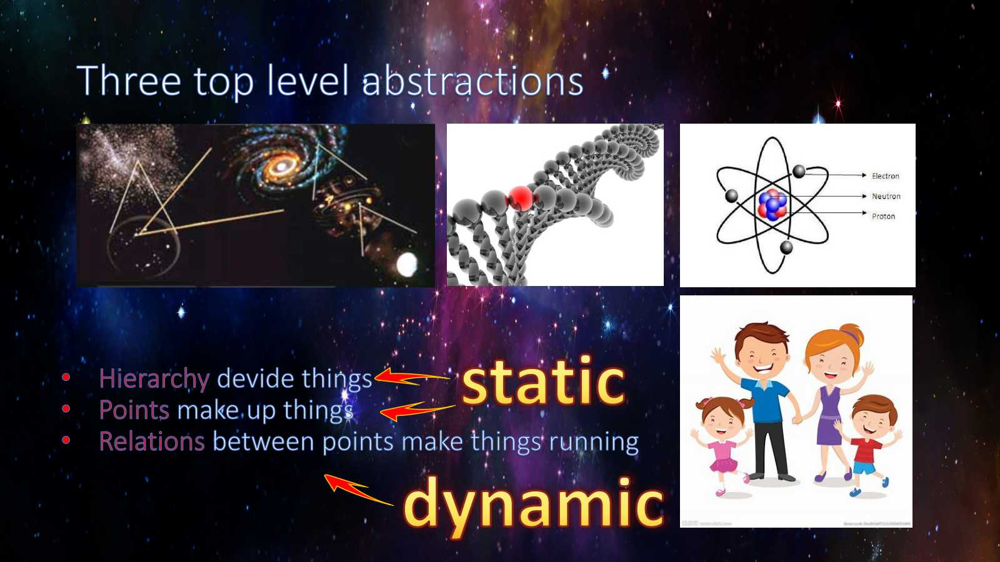
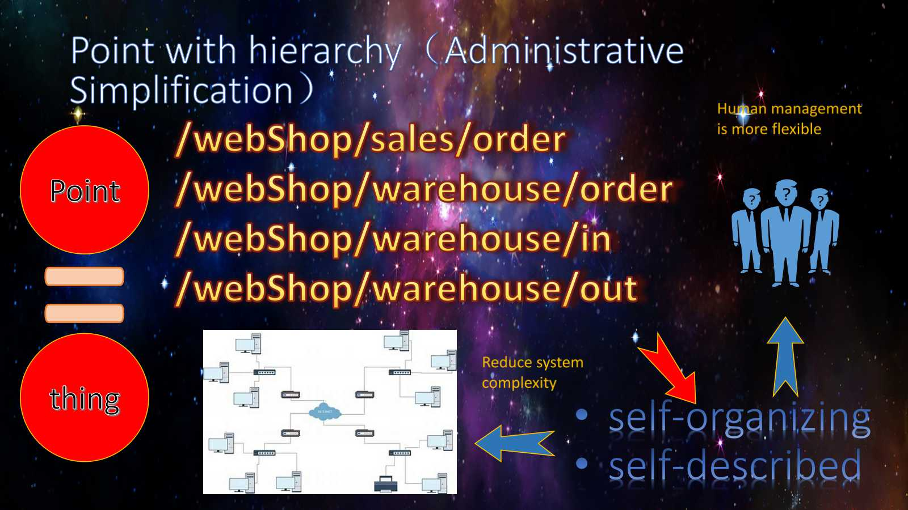
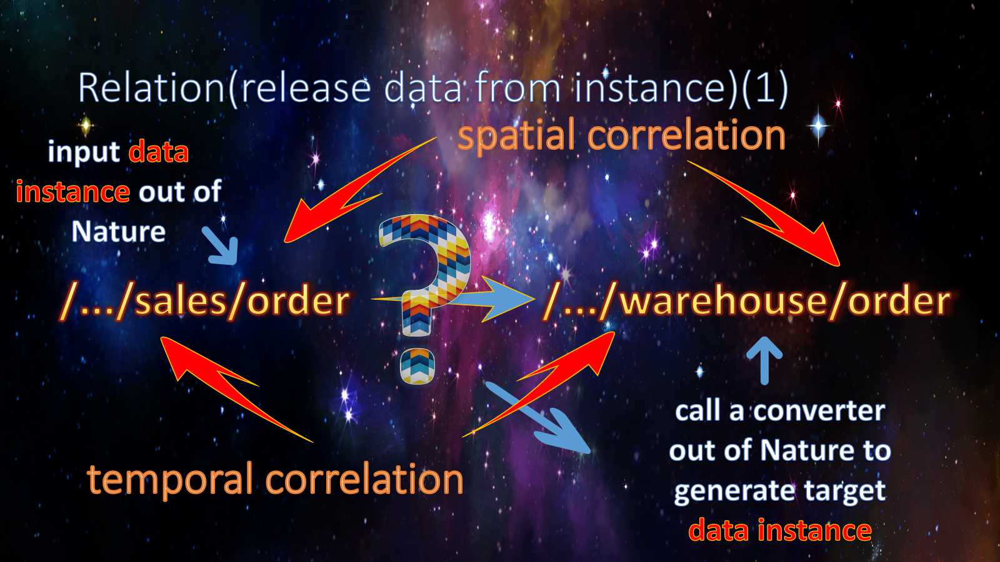
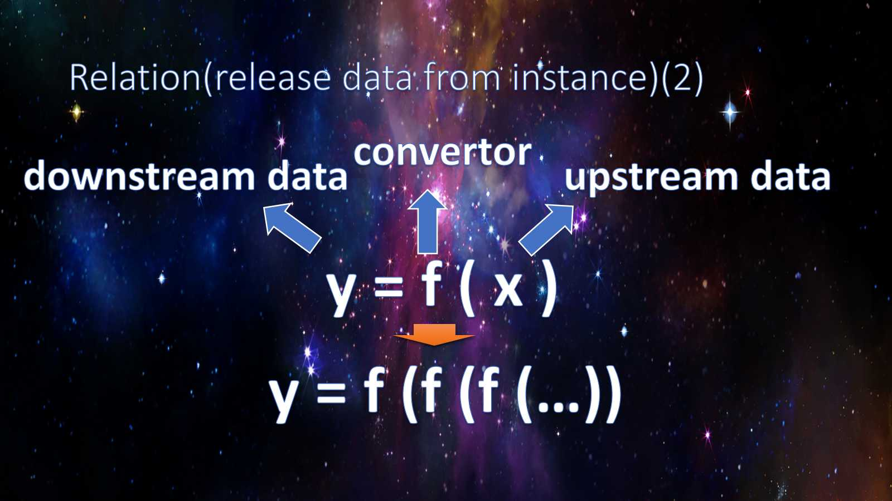
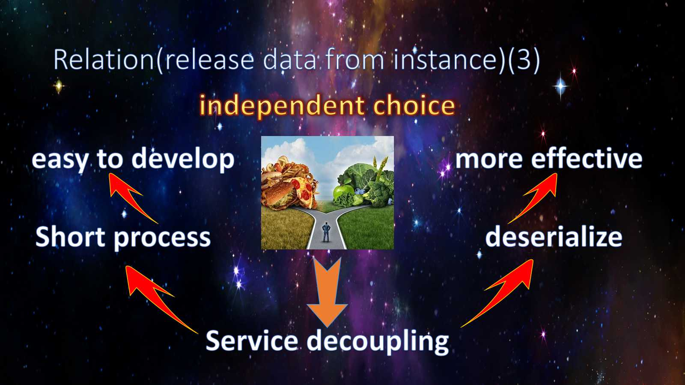
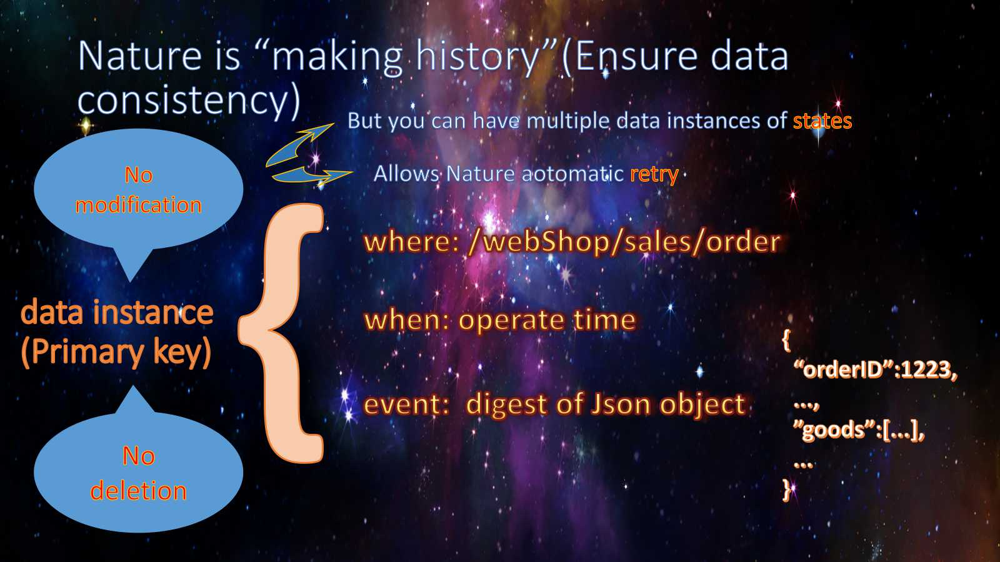
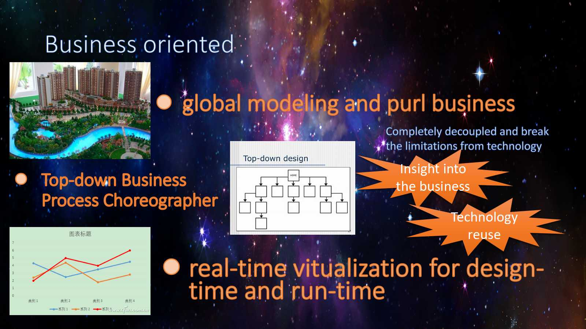
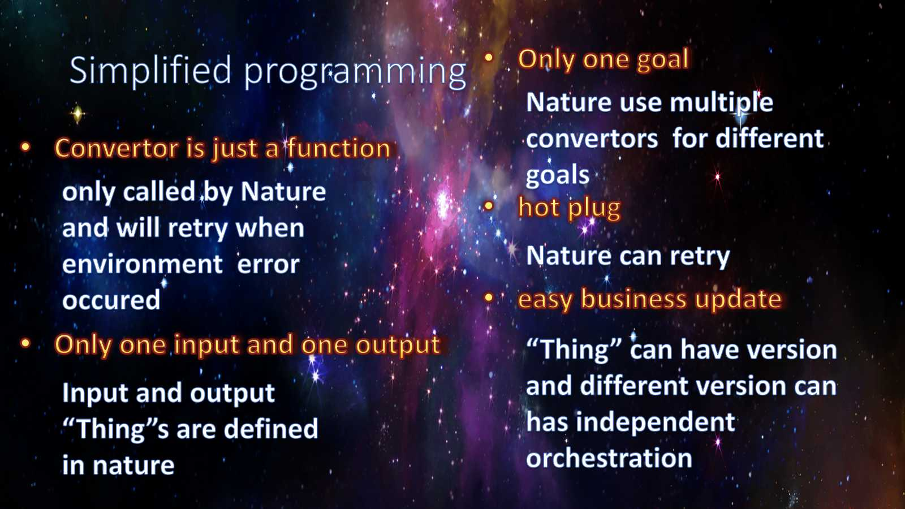

# Nature

Nature Help you to manage your data from a __High Perspective__. and automatic converting one data to another data incessantly, this will be continuing until all data __assigned by you__ be converted.

Sorry for the  __Nature__ word that named for this project.  Nature means all things,  surely this Nature can not, but I could not think out an suitable word to describe it. It can do all the topic's (__Workflow__, __Message Queue__, __Stream__, __BPM__, __Map Reduce__, __Gateway__, __Distributed_System__ and __Database__) works which I list for this project.

Please do not think it too complicated. there are only few things be introduced in this project: __data__ and __relation__ between data. Just like atoms and there relations make up the complex world, in this project __thing__ make up all your business. So I like the name __Nature__. 

## A big question

This project orient to many fields, and each field have their own mature and good projects. why do I give a new one? 

No, the project only focus on one field: __Data__. I have no intention of compelling with other fields, it's just in these fields, let us to see it deeper.

### Functions vs goals

__Workflow__, __Message Queue__, __Stream__, __BPM__, __Map Reduce__ are __functions__ oriented, it may let business go, but when business grow very large, you may __lost__ in functions, because function can __hide goals(data) inadvertently__ and one function can be easily replaced with another, so we maintain functions uneasy.

Nature let you to plan your __goals__ (data), so there are clearly in there and not be replaced easily.  nature __"hide functions deliberately"__ for you to easy you work. So nature can simplify your Road Map or current Topographic Map greatly.

### Bottom-up management vs top-down management

__Gateway__, __Distributed_System__ and __Database__ are __bottom-up management__. They are technology oriented, there manage their own affairs in their own way, so it's hard to unify and simple the management.

Nature let you declare the relation  between goals  and who can do transfer between the goals.  This is all you need to do, other things nature will take care.

- Nature like a __gateway__: You don't care the data go where and how to go.
- Nature like a __distributed system__: you don't care data availability and consistently.
- Nature like a __KV-database__:  you can query data you putted in and transferred.

So Nature let you manage your business on the __Top perspective__,   don't care __Route__, __Distribute__,__Store__ and other problems. But these is not all, Nature will support plugins(not implement yet.).

## A concrete example

​	Assume we want to implement an Online-Shop  system.

### plan goals

### runtime

## Not finishing

Nature is a abstract from the real nature. It is a __dynamic system__ which changes `thing`s and transforms `thing`s __incessantly__ over time, but all It's history could be __traced__. 

Nature is a __business process choreographer__, she decouple business data from technology such as __service__, __Interface__ etc.,
and take care of your data in consistence state, 
but you need to give the data to Nature first.

Nature like a proxy between services, and make the service easy to develop and maintenance.

Important : Nature now is in very earlier stage.

## Pain points of the reality

Communication between services is unreliable, 
It would be a complex, repetitive and hard work for coding, testing. Another important thing  is to make a call idempotent. It would spend our much time and money on it.

Service is the owner of data, and control the entry for the data. 
If you want to change the date you must chang service first, 
but service is heavy to develop and deploy.

We can't manage data directly, because it under service. 
managing services should be never the key parts to achieve our administrative purposes，
so there are a lot of redundant service manage works to do. 

## Concepts

Like 7 Layers of the OSI Model, we must put a problem into a layer, 
I named it here `Thing`.
It let you to shrink it's range and make it easy to study, this is why I call it `Thing` but not layer.
A `Thing` may have many points and `Relation` may exits between points.
The `Thing` and point are __Static__, once they are created they can't be changed.

Relative to `Thing` and point, `Relation` is __Instantaneous__, either it happened or it has not.
so relationships are very time-dependent，`Relation`'s can change over time.
Maybe __Event__ is a good word to express the meaning. but event has a random meaning,
yet relationships emphasize specific behaviors of specific participants,
so I choice `Relation`

Let me say more about `Thing` and point. 
A `Thing`may have points, and points maybe another `Thing` for sublayer points.
So point and `Thing` are conceptually equivalent.
I think `Thing` feel more meaningful than point. so I use `Thing` to express `Thing` and or point.

An amazing thing is that `Thing` contains __Hierarchy__. 
The benefit of this is simplify Nature and give freedom management ability to human. 
`Nature` don't care of __Hierarchy__ but need to identify every `Thing`, 
this is a easy way to satisfy `Nature` and human management simultaneously.

`Thing` is only a define, at run-time you must bind an `Instance` to `Thing`.
If a `Relation` exists between two `Thing`'s, 
`Nature` will give upstream `Instasnce` to a converter which is binding to the certain `Relation` and it is at anywhere outside the `Nature`.
Then the converter generate new `Instance`s for the downstream `Thing`.
    
Here the `Relation` made a great job: It locked the __Geographic and Time Coordinates__, 
they are important for `Natrue` to retry when failed the execution. 

Converter is just one simple function, and the converter achieve __only one__ goal for the `Nature`.
Converter do no need to know all the other goals in `Nature`,
`Nature` will take care of them by call the converters recursively.

It is very easy to organize the goals in `Nature`.
There is no __Flow Control__, so there is no  __loop__, no __if__ to use to do __Business Process orchestration__ in `Nature`.

down-thing to __select__ upper-thing but not upper-thing to __control__ down-things.
because direct upper-things are more less down-things and __control__ will more complex than __select__..
This mechanism greatly simplifies the process.

Another key point is `Instance` bind to `Relation` but not to a __technical__ `Interface`.
It's purl business dependence,it has nothing to do with technology.
Then `Relation` made a __very short process__, only one step,
but the __simple relation__ can form any complex and large network.

There are good news for developers too, __short process__ will be easy to develop, 
and `Nature` try to run the __short process__ in parallel.

`Nature` only insert `Instance` to db, no __deletion__ no __update__.
`Nature` use __state version__ to express any chang on an `instance` and not all `Thing` have states.
This feature let `Nature` run converter equally for any times, tt is __idempotent__.

## Significance

Nature __short process__ can organize all the your business into a web directly,
will will give you a global view of you whole business, 
whether it's the bird taking the big picture or the insight into the details,
and you can see every data's flow in __real-time__.  

The most important point is, 
Nature let you orchestrate the date flow over the services, 
no technology limitation but pure business. 
It make the `Thing` is what it should be.
Nature will be a **Business Command Center**!

