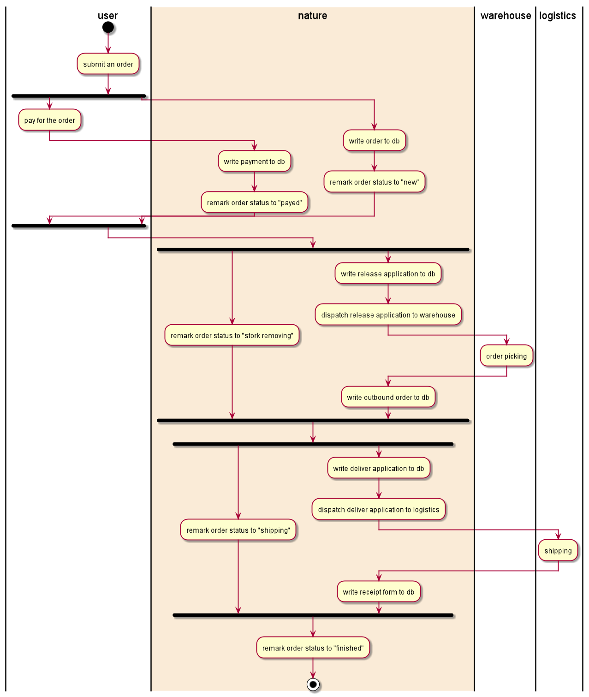
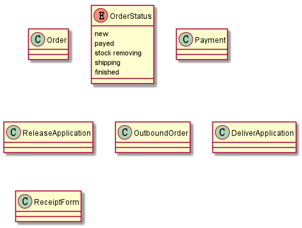
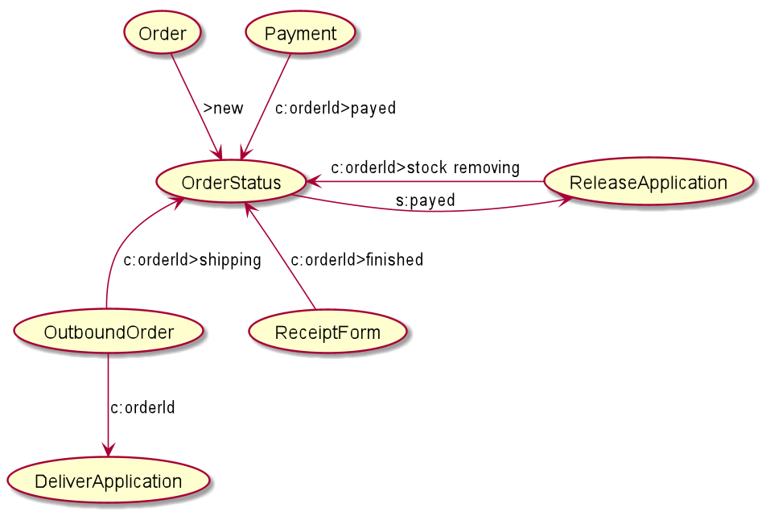

# A concrete example
The whole code of this example you will be find at [Nature_Demo](https://github.com/llxxbb/Nature-Demo) project. 

Assume we want to implement an Online-Shop  system, and let's start at simple, the processing flow is shown as follow:



## plan goals

This is the first step for manager, Let list what data we wanted.



All this must defined in Nature. otherwise Nature will refuse to accept it. Don't be afraid of the class diagram, you need not to write any code, just fill these goals to Nature DB's table: `thing_defines`.  I had written the sql for you

```sqlite
INSERT INTO thing_defines ("full_key",description,version,states,fields) VALUES
('/B/Sale/Order',NULL,1,NULL,NULL),
('/B/Sale/OrderStatus',NULL,1,'new,payed,stock removing,shipping,finished',NULL),
('/B/Finance/Order/Payment',NULL,1,NULL,NULL),
('/B/Warehouse/ReleaseApplication',NULL,1,NULL,NULL),
('/B/Warehouse/OutboundOrder',NULL,1,NULL,NULL),
('/B/Logistics/DeliverApplication',NULL,1,NULL,NULL),
('/B/Logistics/ReceiptForm',NULL,1,NULL,NULL);
```

__Notice:__ I used the form "/B/level1/level2/../level_n/your_goal" for each goal.  The "/B" is `Thing Type` for `Businuss`, this is must be the first part of the `full_key`. And the "level1" to "level_n" are used to organize you goals, they are important for a great deal of goals.

__Notice:__  I specified status field for the `OrderStatus` goal, it is the only one for this example.

## Specify how and who achieve the goals

The second step is design path from one goal to another, let's see:



I drew the picture intent to make you understand easily. in actually the data makes up this picture comes from another table: `one_step_flow`. Let's see:

```sqlite
INSERT INTO one_step_flow
(from_thing, from_version, to_thing, to_version, settings)
VALUES('/B/Sale/Order', 1, '/B/Sale/OrderStatus', 1, '{"executor":[{"protocol":"Http","url":"http://onlineShop:7602","proportion":1}]}'),
('/B/multi_downstream/from', 1, '/B/multi_downstream/toA', 1, '{"executor":[{"protocol":"LocalRust","url":"local://multi_downstream","proportion":1}]}'),
('/B/multi_downstream/from', 1, '/B/multi_downstream/toB', 1, '{"executor":[{"protocol":"LocalRust","url":"local://multi_downstream","proportion":1}]}');

```

The `from_thing`, `from_version`, `to_thing`, `to_version` represent the arrow's direction on the picture. The settings is little complex. It's a [JSON object](../reference.md#settings)


Just like the table name, each row only flow one step. and we can connect the rows to the picture above.


## Unfinished

When there is a `Order` we want to generate an `OrderStatus` and marked with `new`


## runtime

多个库房的问题

多次中转的问题

