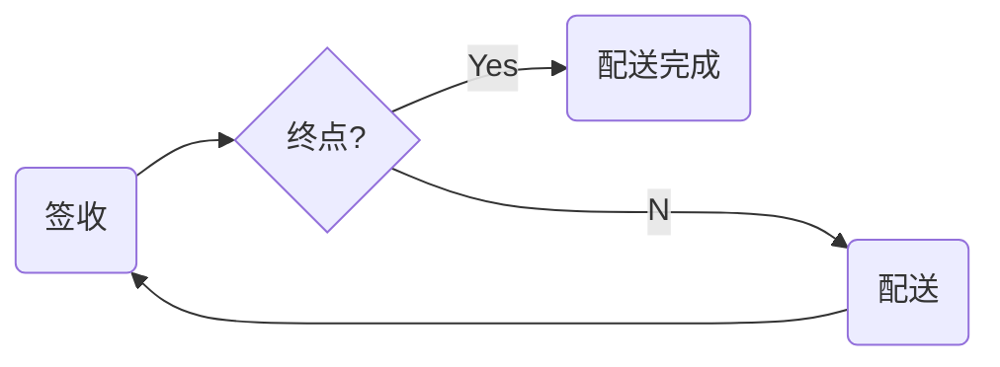

# 附录：多个配送中转站

在现实情况下，一个需要配送的商品，往往需要经过多个配送中转站才能到客户手里。其逻辑如下：



大家可以看到这里有个**环状**结构，下面我们用Nature 来解决这个问题。元数据和关系定义如下：

```mysql
INSERT INTO meta
(meta_type, meta_key, description, version, states, fields, config)
VALUES('B', 'delivery', '', 1, '', '', '');

INSERT INTO meta
(meta_type, meta_key, description, version, states, fields, config)
VALUES('B', 'deliveryState', '', 1, 'new|finished', '', '{"master":"B:delivery:1"}');

-- delivery --> deliveryState
INSERT INTO relation
(from_meta, to_meta, settings)
VALUES('B:delivery:1', 'B:deliveryState:1', '{"target":{"state_add":["new"], "append_para":[0,1]}}');

-- deliveryState --> delivery
INSERT INTO relation
(from_meta, to_meta, settings)
VALUES('B:deliveryState:1', 'B:delivery:1', '{"selector":{"state_all":["finished"], "context_all":["mid"]}, "use_upstream_id":true, "executor":{"protocol":"localRust","url":"nature_demo:multi_delivery"}}');
```

上述脚本来源于 nature-demo::doc::demo-multi-delivery.sql

`delivery`：是具体的物流信息，如包含从哪里到哪里。这里我们模拟两次中转： A->B->C->D， 货物从A出发， D是终点。

`deliveryState`：是物流的状态，为简单起见，我们我们只有 new 和 finished 两个状态。

`delivery --> deliveryState` ：用于自动生成状态为 new 的配送状态数据（无需编码），具体介绍请参考[之前示例](emall-1-order-generate.md)

- **Nature 要点**："append_para":[0,1] 是说我们要从上游复制 para 到下游，具体请看[relation.md](https://github.com/llxxbb/Nature/blob/master/doc/ZH/help/relation.md)。在本示例里我们将配送的起始地与目的地一起放到了 `Instance.para` 中。形式如 “A/B”。

`deliveryState --> delivery`：用于当前配送结束后，生成后续的配送任务。

- **Nature 要点**：如果指定了多个`选择器`则选择器之间是`与`的关系，既必须同时满足才能触发`执行器`。`deliveryState --> delivery` 用到了`state_all`和`context_all`两个选择器，两个都满足后才能执行`multi_delivery`。
- **Nature 要点**：`delivery --> deliveryState` 和 `deliveryState --> delivery` 构成了一个业务上的**循环**，而我们避免了 loop, for 和 while 等这些编程元素。

来看下我们的编码工作，配送单的输入请参考：nature-demo::multi_delivery.rs, 执行器的代码请参考：nature_demo::multi_delivery。在输入端我们只需要提交一个配置单，但需要提交三个状态数据以说明配送的状态，前两个需要指定 `Instance.context` 为 “mid”, 最后一个需要制定 `Instance.context` 为非“mid”（在这里我们用了“end”）。在执行器的代码中，有下面的代码，用于生成下次配送任务的起止地点：

```rust
    ins.para = match para {
        "A/B" => "B/C".to_string(),
        "B/C" => "C/D".to_string(),
        "C/D" => "error".to_string(),
        _ => "err2".to_string()
    };
```

"C/D" 或 "_" 两个分支用于验证 配置设置的正确性以及 Nature 执行的正确性。让我们看下是否有 `Instance.para` 为 "error" 或 "err2" 的实例产生。运行下面的代码：

```shell
nature.exe
cargo.exe test --color=always --package nature-demo --lib multi_delivery::test
```

运行后的数据如下：

| ins_key | context | states | state_version | from_key |
| ------- | ------- | ------ | ------------- | -------- |
|B:delivery:1\|0\|A/B|         |        | 0 |          |
|B:delivery:1\|0\|B/C|         |        | 0 |B:deliveryState:1\|0\|A/B\|2|
|B:delivery:1\|0\|C/D|         |        | 0 |B:deliveryState:1\|0\|B/C\|2|
|B:deliveryState:1\|0\|A/B|| ["new"] | 1 |B:delivery:1\|0\|A/B\|0|
|B:deliveryState:1\|0\|A/B| {"mid":"mid"} | ["finished"] | 2 |          |
|B:deliveryState:1\|0\|B/C|         | ["new"] | 1 |B:delivery:1\|0\|B/C\|0|
|B:deliveryState:1\|0\|B/C| {"mid":"mid"} | ["finished"] | 2 |          |
|B:deliveryState:1\|0\|C/D|         | ["new"] | 1 |B:delivery:1\|0\|C/D\|0|
|B:deliveryState:1\|0\|C/D| {"end":"end"} | ["finished"] | 2 | |

很高兴，我们又一次见证 Nature 对流程的控制能力，这次是循环结构。

- **Nature 要点**：基于前面的示例，足以看出 Nature 可以有效应对复杂的业务流程。如果将这些流程控制从代码中移出并交由 Nature 来管理，并用配置的方式来增加控制的灵活性，将非常有利于业务的快速迭代。同时，由于代码中没有了流程控制，代码间将变得极其简洁，大幅度降低彼此之间的耦合度，这对代码的稳健性、可维护性极其有利。